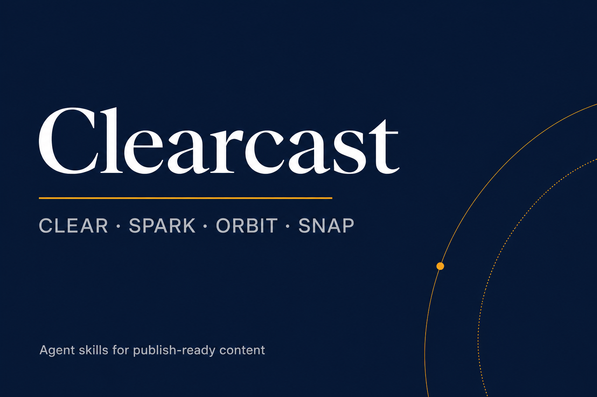

# Clearcast — Agent Skills for Blog SEO, AEO, Social Content & Discovery

<p align="center">
  
</p>

**Clearcast** is an MIT suite of Agent Skills for **Claude Code**, **Cursor**, and **Cowork**: publish-ready blogging, multi-pass editing, platform-native social posts, and multi-surface content strategy — with a hard ban on fabricated statistics.

> Docs: [dranshrad.github.io/clearcast](https://dranshrad.github.io/clearcast/) · Repo: [github.com/dranshrad/clearcast](https://github.com/dranshrad/clearcast)

Updated: 2026-07-25

## Why Clearcast?

Content should (1) help a reader finish a job, (2) be extractable for AI answers (AEO readiness), and (3) cast into social without inventing numbers. Clearcast ships **CLEAR**, **SPARK**, **ORBIT**, **SNAP/PULSE**, Studio Desk, and Cue Deck — plus a binding [Grounding Law](skills/blog-engine/references/grounding.md).

## Skills

| Skill | Framework | Use for |
|-------|-----------|---------|
| [clearcast](skills/clearcast/) | Router | Pick / compose skills |
| [blog-engine](skills/blog-engine/) | **CLEAR** | Articles, claim ledgers, Ship Scan, Cite Surface |
| [editorial-pass](skills/editorial-pass/) | **SPARK** | Multi-pass polish, Tone Retarget, Voice Canon |
| [social-cast](skills/social-cast/) | **SNAP + PULSE** | Hooks, posts, atomize, calendars, analytics |
| [orbit-discovery](skills/orbit-discovery/) | **ORBIT** | Surface bets, Echo Map, Close Path |
| [studio-desk](skills/studio-desk/) | Ops | Workspace Boot, versions, export, Ship Gate |
| [cue-deck](skills/cue-deck/) | Prompts | Reusable grounded cue cards |

## Install

### Claude Code

```bash
git clone https://github.com/dranshrad/clearcast.git
mkdir -p ~/.claude/skills
cp -R clearcast/skills/* ~/.claude/skills/
```

Plugin-style (from repo root, Claude Code):

```text
/plugin marketplace add dranshrad/clearcast
/plugin install clearcast@clearcast-marketplace
```

Or: `claude plugin install .` when this directory is the working tree (if your Claude Code build supports local plugin install).

### Cursor

```bash
git clone https://github.com/dranshrad/clearcast.git
mkdir -p ~/.cursor/skills
cp -R clearcast/skills/* ~/.cursor/skills/
```

### Cowork / skill zip upload

Zip each folder under `skills/<name>/` (must contain `SKILL.md`) and upload via **Cowork → Customize → Skills**. Upload all seven for the full suite, or start with `clearcast` + `blog-engine`.

Project-local (either client): copy into `.claude/skills/` and/or `.cursor/skills/`.

Details: [INSTALL.md](INSTALL.md) · [CLAUDE.md](CLAUDE.md) · [docs/getting-started.md](docs/getting-started.md).

## Grounding (no hallucinations)

Before any draft is “final”:

1. Material claims are on a **claim ledger** (`verified` / `attributed` / `author-supplied`)
2. No invented stats, studies, quotes, or customer results
3. Uncertain points use soft language or are omitted
4. `blocked` ledger rows must be fixed or removed

Full rules: [skills/blog-engine/references/grounding.md](skills/blog-engine/references/grounding.md).

## Typical pipeline

1. `orbit-discovery` — triage / surface bet  
2. `blog-engine` — draft + ledger + stress tests  
3. `editorial-pass` — SPARK  
4. `social-cast` — atomize  
5. `studio-desk` — ship  

## Related repositories

| Project | Link |
|---------|------|
| Voice notes → Artifacts | [voice-notes-to-anthropic-artifacts](https://github.com/dranshrad/voice-notes-to-anthropic-artifacts) |
| LibCST LLM refactorer | [llm-cst-refactorer](https://github.com/dranshrad/llm-cst-refactorer) |
| Self-correction loop | [automated-self-correction-loop](https://github.com/dranshrad/automated-self-correction-loop) |
| Anthropic audio gateway | [anthropic-audio-gateway](https://github.com/dranshrad/anthropic-audio-gateway) |

See [docs/ECOSYSTEM.md](docs/ECOSYSTEM.md).

## License

[MIT](LICENSE) © 2026 Divyansh Gupta
